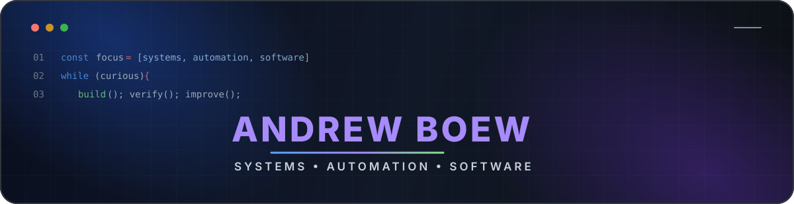
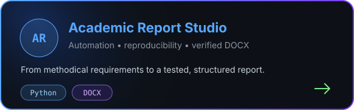
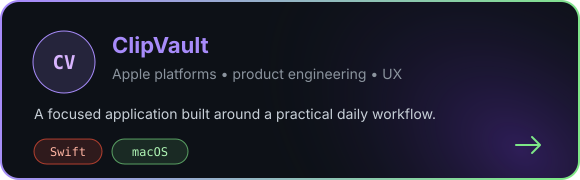

## Tech stack

### Languages

 

### Platforms & frameworks

### Development & build

 

### Software analysis

### Documents & reproducible reports

## Featured work

| Project | Focus | Stack |
|---|---|---|
| [Academic Report Studio](https://github.com/Andrew-Boew/Academic-report-studio-SPBPU) | Выполнение учебных заданий и подготовка проверяемых DOCX-отчётов | Python, DOCX |
| [ClipVault](https://github.com/Andrew-Boew/ClipVault) | Прикладной продукт для платформ Apple | Swift |
| [FS Manager](https://github.com/Andrew-Boew/fs_manager) | Управление файловой системой и реестром | Python |
| [Database AVL](https://github.com/Andrew-Boew/Database_AVL) | Быстрый поиск записей на основе AVL-дерева | C |
| [Sokoban](https://github.com/Andrew-Boew/Sokoban) | Реализация классической логической игры | C |

## GitHub activity

## Contact

### Есть идея или техническая задача?

Открыт к обсуждению проектов, технических идей и совместной разработки.

